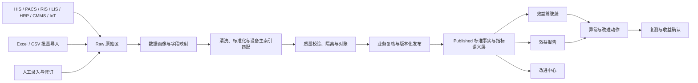

# 勇虹医疗 · 设备效益管理平台

## 行业、开源项目调研与“数据配置中心”产品方案

日期：2026-08-11  
范围：GitHub 开源案例、国内外行业产品、现有平台功能盘点、指标和报告设计、真实数据接入与清洗方案

---

## 一、结论先行

### 1. 勇虹不应直接照搬某一个开源项目

GitHub 上目前没有一个成熟开源系统能同时完成：

> 医疗设备台账 + 维修保养 + HIS/PACS 工作量 + 收入成本折旧 + 效益指标 + Excel 清洗 + 管理报告 + 改进闭环

最接近医疗设备业务的是 [Rwanda MEMMS](https://github.com/clintonhealthaccess/RW_memms)，但代码长期未更新；工程成熟度较高的 [Atlas CMMS](https://github.com/Grashjs/cmms) 主要解决通用维修管理，不理解医疗工作量和经济效益。因此，勇虹应保留自己的产品和数据模型，分别吸收：医疗设备领域模型、维修闭环、数据清洗、指标语义层、医疗接口标准和资产交互，而不是直接 Fork 一个系统作为底座。

### 2. 行业真正愿意付费的不是“多几个图表”

国内外产品和医院案例共同指向以下购买价值：

1. 用可信数据回答“设备是否买多了、用少了、停太久、修得贵”；
2. 自动形成全院、科室、单机效益报告，减少人工拼 Excel；
3. 为新增采购、共享调拨、维保方式和更新淘汰提供证据；
4. 把异常指标转成负责人、截止日期、整改动作和复测收益；
5. 满足评审、审计、设备临床使用管理和数据追溯要求。

阿基米德的公开方案已经把设备成本配置、全院/科室/单机报告、原因分析和整改措施放在同一产品链路中；Siemens、Philips、GE 则重点展示吞吐量、利用率、停机、维护和资产规划。[阿基米德官方方案](https://www.ajmd-med.com/solution-benefit/)｜[Siemens teamplay Usage](https://www.siemens-healthineers.com/en-us/digital-health-solutions/teamplay-performance-management-applications/teamplay-usage/)｜[Philips PerformanceBridge](https://www.usa.philips.com/healthcare/product/HC896001/null)｜[GE Fleet Metrics](https://services.gehealthcare.com/gehcstorefront/fleet-metrics)

### 3. 当前平台已具备较好的“展示与治理外壳”，但真实数据链路还没有闭合

现有版本已经具备驾驶舱、效益分析配置、报告工作流、改进中心、设备台账、成本录入、数据源目录、权限审计和云端运维等模块；报告的草稿、审核、批准、发布、导出、快照和版本思路尤其值得保留。

但目前核心事实数据仍以示例数据、静态洞察和 JSON 聚合资源为主。“数据源与口径”页面目前属于配置原型，并没有真正执行连接、批量导入、清洗、隔离、复核、发布和回滚。换言之：**云端持久化不等于已经接入真实业务数据库。**

### 4. 下一阶段应把现有“数据源与口径”升级为完整的数据准备链

建议新增独立的“数据准备中心”，统一承接 HIS/PACS/LIS/HRP/CMMS/IoT 接口、Excel/CSV 和人工录入，并形成四层数据区：

> Raw 原始区 → Staging 待处理区 → Curated 标准区 → Published 发布区

驾驶舱、报告和改进中心只能读取 Published 数据，不能直接读取刚上传的表格或可随时修改的台账 JSON。

### 5. “左上角连点 6 下”可以做，但只能是入口彩蛋，不能作为安全机制

建议 4 秒内连续点击品牌区域 6 次，进入 `/data-workbench`，并显示“数据准备模式”标识。真正的安全边界仍需服务端权限控制：`data.ingest`、`data.clean`、`data.review`、`data.publish`、`connector.manage`。无权限用户即使知道网址也不能进入。

---

## 二、GitHub 开源项目调研

> Stars 和活跃日期为 2026-08-11 调研快照，会随时间变化。许可证仅作产品筛选提示，正式使用代码前仍需法律复核。

| 项目 | 适合借鉴的能力 | 与勇虹的差距 | 建议 |
|---|---|---|---|
| [Rwanda MEMMS](https://github.com/clintonhealthaccess/RW_memms) | 医疗设备、机构/科室、设备状态、供应商、备件、纠正性维修、预防性维修、工单、HMIS 报告和指标 | 技术栈老旧；缺少 HIS/PACS 工作量、收入成本、ROI、现代清洗与血缘 | 深看领域对象和医疗设备业务骨架，不作为代码底座 |
| [Atlas CMMS](https://github.com/Grashjs/cmms) | 工单状态机、自动触发、停机、可靠性、维修和人工成本、库存、采购审批、移动端 | 通用 CMMS，不理解医疗检查量、收入和设备效益 | 借鉴维修闭环与移动端体验；AGPL/商业许可需谨慎 |
| [Shelf](https://github.com/Shelf-nu/shelf.nu) | 二维码、预约、领用归还、位置层级、自定义字段、CSV、保养校准提醒、审计时间轴 | 非医疗，无经济效益和医院接口 | 借鉴设备详情页、批量导入和追踪体验 |
| [Snipe-IT](https://github.com/grokability/snipe-it) | 资产标签、采购日期、折旧、盘点、CSV、API、批量维护、审计 | IT 资产导向，缺少医疗专业维修与效益模型 | 借鉴台账、折旧、导入反馈和 REST API |
| [OpenBoxes](https://github.com/openboxes/openboxes) | 医疗供应链、备件批次、收发存、调拨、盘点、库存准确率、供应商 | 面向药品耗材和仓储，不是大型设备效益 | 借鉴备件库存和消耗事实表 |
| [OpenRefine](https://github.com/OpenRefine/OpenRefine) | 导入预览、列画像、Facet、聚类去重、值映射、对账、可撤销清洗步骤和配方 | 独立清洗工具，不负责审批发布和业务指标 | **数据准备中心最值得借鉴的交互来源** |
| [Apache Superset](https://github.com/apache/superset) | 指标语义层、维度下钻、筛选联动、数据权限、嵌入图表 | 只消费清洗后数据库，不解决业务写入和改进闭环 | 借鉴统一指标定义，不建议直接暴露给普通用户 |
| [Medplum](https://github.com/medplum/medplum) | FHIR、OAuth/OIDC、接口鉴权、异步转换、原始消息保留、医疗数据标准化 | 临床数据平台，不是设备 CMMS 或投资效益系统 | 借鉴连接器层、标准资源和追溯设计 |

### 最值得落到勇虹的 8 个开源模式

1. **四层数据区**：原始、待处理、标准、已发布严格隔离。
2. **清洗步骤可见**：每次改列名、转类型、字典映射、去重、合并都成为可重放、可回滚的步骤。
3. **医疗设备统一主索引**：把资产编号、设备号、序列号、科室、位置、品牌型号和不同系统别名统一到一个主设备 ID。
4. **设备全时间轴**：采购、安装、使用、移动、停机、维修、保养、校准、费用、收入、改进行动在同一页串联。
5. **指标语义层**：指标的分子、分母、范围、窗口、来源、单位、版本和负责人集中管理。
6. **异常到改进闭环**：阈值触发 → 建议 → 负责人 → 截止日期 → 执行证据 → 复测 → 收益确认。
7. **接口和文件走同一通道**：API、Excel、CSV 和人工编辑最终进入同一映射、清洗、校验和发布模型。
8. **运营时钟和经济时钟合一**：可用率/停机/维修与检查量/收入/成本/回报在同一设备和同一期间上关联。

---

## 三、行业平台和案例调研

### 3.1 国内案例

| 平台/案例 | 官方公开能力 | 对勇虹的启发 |
|---|---|---|
| [阿基米德 · 医疗设备效益分析](https://www.ajmd-med.com/solution-benefit/) | 全院、科室、单台设备报告；维护、折旧、人工、水电、空间等成本配置；效益评价、原因分析、纠正措施 | 国内同类最直接参照，应重点对标“报告—原因—行动”链路 |
| [医依医疗设备管理平台](https://www.yiyikefu.com/) | HIS/PACS/RIS、移动端、IoT、运行频率、成本和科室绩效、维修保养资产管理 | 说明客户更愿意接受“设备全生命周期 + 使用效益”一体化，而非孤立 BI |
| [康医通设备管理](https://www.kangyitong.cn/deviceweb/) | 设备卡片、二维码、报修、保养提醒、IoT 开关机、HIS/LIS/PACS 单机数据 | 单机入口、二维码和现场工程师流程值得补入勇虹 |
| [上海棕旨 iMES](https://www.zzitec.com/solution.html) | 资产、共享、IoT、效益、数据监测和临床工程数字化 | 可把共享调拨、临床工程与效益整改联动 |
| [青岛市市立医院案例](https://www.qdslyy.cn/zhuanti_view.aspx?id=94095) | 按月分析单台设备成本、收入和收益率，对异常设备预警并采取行动 | 证明“单机月报 + 预警 + 整改”是医院可理解、可执行的落地方式 |

国内监管也强调大型医用设备配置使用应结合技术需要和成本效益，因此平台不能只展示设备运行量，还要保留测算依据、审批痕迹和可审计口径。[国家卫生健康委《大型医用设备配置与使用管理办法》](https://www.nhc.gov.cn/wjw/c100221/202201/340006dbdd684049aca1d5f79f4609de.shtml)

一篇 2025 年公开研究给出了很贴近勇虹目标的医院架构：通过 DICOM 接 CT/MRI/超声/DR，通过 LIS 接检验，通过影像/报告系统接内镜，并结合 HIS、资产和财务数据，完成标准、汇聚、存储、清洗、分析、调用、权限与安全管理。[《大型医用设备效益评价信息系统设计与应用》PDF](https://zgylqxzz.xml-journal.net/cn/article/pdf/preview/10.12455/j.issn.1671-7104.240684.pdf)

### 3.2 国际案例

| 平台 | 官方展示重点 | 勇虹可借鉴 |
|---|---|---|
| [Siemens teamplay Usage](https://www.siemens-healthineers.com/en-us/digital-health-solutions/teamplay-performance-management-applications/teamplay-usage/) | 吞吐量、患者换台时间、每小时检查数、机台占用、患者总数、设备分组、对标、图表导出 | 把“利用率”拆成有运营意义的吞吐、换台和占用，而非只给一个百分比 |
| [Philips PerformanceBridge](https://www.usa.philips.com/healthcare/product/HC896001/null) | 通过 HL7/DICOM 整合 RIS/PACS/EMR，多厂商、近实时、自定义驾驶舱、扫描仪利用率、计划性分析 | 用标准接口和厂商中立模型建立影像设备运营驾驶舱 |
| [GE Fleet Metrics](https://services.gehealthcare.com/gehcstorefront/fleet-metrics) | 全院设备状态、服务活动、在线/停机、老化、PM、生命周期和资本规划 | 从效益月报延伸到设备更新和资本预算 |
| [TRIMEDX 临床资产管理](https://www.trimedx.com/services/clinical-asset-management) | 资产盘点、库存优化、服务策略和更新规划 | 把“买不买、留不留、共享还是替换”作为最终决策输出 |
| [ECRI 资本替换计划](https://dev-home.ecri.org/blogs/ecri-blog/use-a-predictive-replacement-plan-to-create-a-better-capital-replacement-process-and-include-these-6-questions) | 安全、风险、寿命、维护、临床需求和预算情景 | 建立 3—5 年更新优先级，而不是只按设备年龄排序 |
| [Accruent TMS](https://www.accruent.com/products/tms) / [Nuvolo 医疗设备管理](https://www.nuvolo.com/story/parkland-health-hospital-system-creates-one-platform-for-hospital-services/) | 工单、合规、临床工程、跨部门资产服务平台 | 效益平台应能连接工程部门实际工单与整改执行 |

### 3.3 官方页面中的展示样式

以下图片来自厂商公开官网，仅供界面和信息层级研究，不建议直接复制视觉资产。

**Siemens：设备利用与工作量趋势**

**Philips：运营驾驶舱与扫描仪利用率**

**GE：设备全院组合、维护和生命周期视图**

建议借鉴的是这些页面的共同结构：**顶部 KPI → 趋势与对标 → 异常设备清单 → 原因 → 可执行建议**，而不是照抄配色。

---

## 四、客户最愿意看什么、为什会采购

按价值优先级建议如下：

| 优先级 | 客户问题 | 平台要给出的答案 |
|---|---|---|
| P0 | 数据可信么，评审和审计能解释么？ | 数据来源、批次、字段映射、公式版本、审批记录、血缘和质量评分 |
| P0 | 这台设备到底用得好不好？ | 工作量、有效开机、可用率、占用、吞吐、换台、停机、同类对标 |
| P0 | 赚不赚钱，成本在哪里？ | 收入、全成本、贡献、ROI、回收期、停机损失、维护成本趋势 |
| P1 | 为什么低效？ | 需求不足、排班不足、等待过长、设备故障、人员瓶颈、数据缺失的证据链 |
| P1 | 下一步具体做什么？ | 共享、调拨、延长开放、优化排班、流程改造、维修、培训、替换、暂停采购 |
| P1 | 做完有没有效果？ | 动作前后对比、目标完成率、已确认收益、未完成原因和责任人 |
| P2 | 未来该买什么、换什么？ | 3—5 年设备更新和资本计划，包含风险、寿命、使用、维护和战略需求 |

厂商公布的节省金额或利用率提升只能作为“单个客户案例”，不应当作通用承诺。例如 TRIMEDX 的公开案例包含特定医疗系统的资产优化节省，适合说明方法价值，不适合作为勇虹项目的默认收益预测。[TRIMEDX Wake Forest 案例](https://www.trimedx.com/resource/wake-forest-baptist-health-leverages-capital-planning-resources-to-optimize-clinical-asset-inventory)｜[TRIMEDX 资产优化案例](https://www.trimedx.com/resource/health-system-saves-5m-by-optimizing-clinical-asset-management)

---

## 五、当前平台左侧菜单功能盘点

### 5.1 当前已有能力

| 菜单 | 当前可以提供的功能 | 当前缺口/风险 |
|---|---|---|
| 效益驾驶舱 | 医院/科室/期间/视角筛选；12 类卡片；设备下钻；跳转报告与配置 | 多项指标仍来自示例或静态洞察；维修、PM、借用等部分内容未接事实表；新设备可能错误继承 MRI 示例指标 |
| 效益分析 | 采集配置、质量与对账、分析公式；字段、工时、分母和阈值规则 | 目前主要是规则配置；没有真实任务、批次、异常隔离、重跑、审核和发布 |
| 报告中心 | 医院/品类/单机报告；模板；草稿、复核、批准、发布；Word/CSV；快照、版本、R2 文件和哈希 | 治理框架较完整，但报告内容仍混有静态或聚合示例；没有完全由已发布事实数据重算 |
| 改进中心 | 目标差距、雷达、情景、行动保存、需求容量、生命周期风险 | 任务流偏轻；缺少执行证据、评论、审批、复测、收益确认和完整历史 |
| 消息中心 | 消息筛选、已读未读、跳转 | 初始消息静态；还没有质量异常、接口失败、阈值越界和任务逾期的真实规则引擎 |
| 使用指南 | 角色路线、月度闭环、页面说明、FAQ | 说明中提到的导入和质量能力有些尚未真正实现，应和正式能力同步 |
| 设备台账 | 搜索筛选、新增编辑、设备详情；采购、安装、科室、型号、状态等字段 | 缺少 Excel 批量导入、去重、映射、变更审批、字段历史和严格校验 |
| 成本中心 | 人工、耗材、固定成本录入与汇总 | 缺少凭证附件、导入、提交复核、月结、冲销和防重复机制；部分固定成本只改聚合值 |
| 驾驶舱配置 | 主题、密度、模块显示/顺序/宽度、个人偏好 | 不能配置指标公式、阈值、图表、过滤器和角色布局 |
| 数据源与口径 | HIS/PACS/LIS/HRP/SPD/IoT/CMMS 等来源目录、负责人、频率、状态、字段模板、字典与责任 | 当前“测试连接”不是真连接；缺少地址、协议、认证、SQL/API、调度、文件上传、映射和运行日志 |
| 权限与审计 | 医院、成员、角色和审计；正式模式可用云数据库 | 需新增数据准备权限；范围定义仍需结构化，邀请和告警执行器尚不完整 |
| 云端运维 | D1/R2 状态、资源计数、健康检查、JSON 备份 | 缺少恢复、备份计划、保留策略、导入任务监控和数据库迁移控制台 |

### 5.2 对当前版本的两个强制修正

1. **立即取消“找不到设备洞察时默认套用 MRI 示例”的回退行为。** 新录入设备如果没有真实事实数据，应显示“暂无数据/待发布”，绝不能显示另一台设备的效益值。
2. **驾驶舱和报告改为只读 Published 标准事实表。** 不能继续把可编辑设备 JSON、静态洞察和硬编码内容混在一起计算正式报告。

### 5.3 建议复用，而不是重做的现有资产

- 现有数据源目录，升级为真实连接器和文件来源管理；
- 现有设备分类采集合同、字段规则和指标字典；
- 现有台账及成本人工录入，统一进入待处理/审核/发布链；
- 现有报告的数据包、快照、版本、审核与发布流程；
- 现有权限、审计、版本冲突检测和云端备份思路。

---

## 六、“数据准备中心”产品设计

### 6.1 总体数据链路

这套设计符合医院多源数据汇聚、标准、清洗、分析和权限安全的公开研究方向，也和 WHO 对数据完整性、及时性、内部一致性、异常值和外部一致性的质量框架相吻合。[WHO Data Quality Assurance](https://www.who.int/data/data-collection-tools/health-service-data/data-quality-assurance-dqa)｜[WHO RHIS General Principles](https://cdn.who.int/media/docs/default-source/world-health-data-platform/rhis-modules/general-principles.pdf)

### 6.2 左侧菜单建议

进入数据准备模式后，左侧切换为以下菜单：

1. **工作台**：今日导入、失败任务、待映射、待复核、待发布、质量趋势和接口健康。
2. **数据源与连接**：HIS/PACS/LIS/HRP/CMMS/IoT/API/SFTP/数据库连接器；地址、协议、凭证、频率、负责人和测试结果。
3. **文件导入**：选择业务模板，上传 Excel/CSV，预览 Sheet、表头、数据类型和样例。
4. **原始批次**：查看每次上传或接口拉取的文件、行数、哈希、来源、时间、操作人和原始快照。
5. **字段与主数据映射**：源字段 → 标准字段；设备别名 → 主设备；科室、项目、费用、设备类型等字典对照。
6. **清洗规则**：类型转换、空值、单位换算、日期、文本标准化、去重、合并、拆分、异常值和规则配方。
7. **数据质量**：完整性、唯一性、有效性、一致性、及时性；错误行隔离、在线修复和错误文件导出。
8. **数据对账**：PACS 检查量 vs HIS 收费量、HRP 收入 vs 退款、CMMS 停机 vs IoT 状态、台账 vs 源系统设备清单。
9. **发布中心**：复核、批准、发布、撤回、更正批次、影响预览和版本回滚。
10. **血缘、监控与审计**：一个驾驶舱数值可追到指标公式、事实行、发布版本、清洗规则、导入批次和原始记录。

### 6.3 “连点 6 下”交互

- 品牌 Logo 区域在 4 秒内连续点击 6 次；超时或点击其他区域后计数清零。
- 第 4、5 次可给予极轻的视觉反馈，第 6 次进入 `/data-workbench`。
- 页面顶部显示“数据准备模式”，并提供明确退出按钮。
- 有权限的实施和数据管理员应同时拥有一个正常可见入口，避免只能靠彩蛋进入。
- 路由和接口均做服务端权限校验，隐藏菜单本身不承担安全职责。

建议权限：

| 权限 | 能力 |
|---|---|
| `connector.manage` | 配置接口、凭证、调度和连接测试 |
| `data.ingest` | 上传文件、创建导入任务、人工录入 |
| `data.clean` | 配置映射和清洗规则、修复隔离数据 |
| `data.review` | 质量复核、业务对账和影响确认 |
| `data.publish` | 发布、撤回、更正和回滚数据版本 |

### 6.4 Excel 导入的推荐体验

1. 选择模板：设备主数据、检查工作量、收入退款、成本、维修停机、保养、患者流程/质量、IoT/能耗；
2. 上传文件并选择 Sheet、表头行、日期/数值格式；
3. 系统自动识别字段，用户手动确认未匹配列；
4. 预览数据画像：总行数、空值、重复值、类型异常、日期范围、极值；
5. 匹配设备主索引和科室/项目/费用字典；
6. 执行清洗配方，显示处理前后行数及每一步影响；
7. 错误数据进入隔离区，可在线修正或下载错误 Excel；
8. 对账并预览发布后哪些设备、指标、期间和报告会改变；
9. 数据管理员复核，业务负责人批准；
10. 发布为新版本，前台刷新，同时保留原版本和一键回滚能力。

### 6.5 第一批标准数据模板

| 模板 | 关键字段举例 |
|---|---|
| 设备主数据 | 主设备 ID、资产编号、设备号、序列号、院区、科室、位置、类型、品牌型号、购置/安装日期、原值、状态 |
| 服务/检查活动 | 设备、项目、开始结束时间、完成/取消、患者/就诊脱敏键、科室、操作人、来源系统记录号 |
| 收入与退款 | 设备、项目、计费时间、应收、实收、退费、医保/自费分类、财务期间、凭证号 |
| 成本 | 人工、耗材、折旧、维修、维保、水电、空间、软件接口、质控、资金成本和分摊 |
| 维修与停机 | 故障、报修、响应、开始修复、恢复、故障类型、工单、人工、备件、外包费、停机分钟 |
| 预防性维护 | 计划日期、完成日期、是否按期、维护内容、结果、下次日期 |
| 患者流程与质量 | 预约、到达、开始、完成、报告、取消、等待、阳性/质量分类；患者键应脱敏 |
| IoT/能耗 | 设备状态事件、开关机、工作/待机、能耗读数、采集时间和设备网关 |

每条标准记录至少保留：`dataset_version`、`import_job_id`、`source_record_id`、`mapping_version`、`rule_version`，并记录创建者、复核者、发布时间和更正链。

### 6.6 批次状态机

`上传中 → 待映射 → 校验中 → 质量异常/待修复 → 待复核 → 可发布 → 已发布`

并支持：`失败`、`已撤回`、`已被更正版本替代`。已经发布的批次不得直接覆盖，修正必须生成更正批次，保留前后差异和回滚路径。

### 6.7 隐私和安全

- 原则上不采集姓名、身份证号、电话等不必要的个人信息；患者和就诊只保留院内脱敏键。
- 原始文件、隔离数据、标准数据和发布数据分别授权；前台普通用户不能查看 Raw 数据。
- 接口凭证加密保存，连接日志不得打印密钥和完整敏感报文。
- 文件上传进行格式、大小、病毒、公式注入和恶意内容检查。
- 所有查看、下载、清洗、复核、发布和回滚均写入审计日志。
- FHIR 可用于部分医疗资源与 Provenance 思路；影像工作状态通常还需结合 DICOM/MPPS、PACS 日志和厂商接口，不能只靠 FHIR。[HL7 FHIR 官方规范](https://hl7.org/fhir/)｜[DICOM MPPS Supplement 17](https://www.dicomstandard.org/News-dir/ftsup/docs/sups/sup17.pdf)

---

## 七、指标体系与计算口径

### 7.1 第一批核心指标

| 指标 | 推荐公式 | 注意事项 |
|---|---|---|
| 设备利用率 | 有效临床使用分钟 ÷ 可排班服务分钟 | 明确是否扣除节假日、维修、待机和非临床科研时间 |
| 开机率 | 实际开机时长 ÷ 计划开机时长 | 不等同利用率；开机但未服务不能算有效使用 |
| 机台占用率 | 患者/样本实际占用分钟 ÷ 可排班分钟 | 适合影像、手术、治疗等机台 |
| 吞吐量 | 完成检查/治疗数 ÷ 有效开放小时 | 应按设备类别和项目复杂度分组 |
| 换台时间 | 下一患者开始时间 − 上一患者结束时间 | 排除跨班、故障和计划停机 |
| 可用率 | 可提供临床服务时间 ÷ 计划服务时间 | 与利用率分开展示 |
| MTBF | 运行时间 ÷ 故障次数 | 故障定义、运行时长来源必须固定 |
| MTTR | 总修复时间 ÷ 已完成维修数 | 明确等待备件和等待审批是否计入 |
| PM 按期完成率 | 按期完成 PM 数 ÷ 到期 PM 数 | 同时展示逾期天数和关键设备覆盖 |
| 全成本 | 折旧 + 维修/维保 + 耗材 + 人工 + 能源 + 空间 + 软件接口 + 质控 + 资金成本 + 分摊 | 成本口径和分摊方法必须版本化 |
| 净贡献 | 设备归属收入 − 全成本 | 收入归属需要与财务和科室确认 |
| ROI | 期间净贡献 ÷ 投资额 | 需标明期间；不应用月度 ROI 与年度直接比较 |
| 静态回收期 | 初始投资 ÷ 年度现金贡献 | 现金贡献为负时不应硬算正常回收年限 |
| TCO | 采购、安装、培训、人工、耗材、能源、维护、软件、停机、处置成本 − 残值 | 适合采购和替换方案比较 |

每个指标必须配置：**名称、业务解释、分子、分母、统计窗口、维度、单位、来源、纳入/排除规则、适用设备类别、生效日期、版本、负责人**。

ROI、IRR、NPV 和回收期可用于采购方案评价，但应与临床安全、质量、可及性和社会效益并列，不能把所有价值强行货币化。医疗设备经济评价研究也常将固定/运营成本、停机收入损失以及 ROI/IRR/NPV/回收期组合使用。[维护经济性案例](https://pubmed.ncbi.nlm.nih.gov/35953804/)｜[设备采购投资评价案例](https://pubmed.ncbi.nlm.nih.gov/40151228/)

### 7.2 指标下钻建议

任何红色指标都必须能够按以下路径解释：

> 全院 → 院区 → 科室 → 设备类别 → 单台设备 → 日期/班次 → 原始记录

每个指标页面同时显示：本期、上期、去年同期、预算/目标、同类设备中位数、数据质量、影响因素和建议动作。

---

## 八、报告格式建议

### 8.1 管理层月报（1—2 页）

- 核心 KPI、本期与上期/同期/预算对比；
- 红黄绿异常、影响金额或影响服务量；
- Top 5 低效设备和 Top 5 改善设备；
- 本月需要决策的采购、共享、维修、替换事项；
- 改进任务完成率和已确认收益；
- 数据质量和未完成对账提示。

### 8.2 科室效益报告（3—5 页）

- 设备组合、原值、折旧、维修和总体贡献；
- 按天/小时利用热力图；
- 同类设备、院内科室或目标值对标；
- 吞吐、等待、换台、取消和停机；
- 原因判断和证据；
- 行动、负责人、目标、截止日期和预计收益。

### 8.3 单台设备报告（2—4 页）

- 身份、位置、生命周期、数据来源和质量；
- 工作量、利用率、收入、全成本、净贡献、ROI、回收期；
- 停机、故障、MTBF、MTTR、PM、维护成本；
- 与同型号/同类别设备对标；
- 保留、增配、共享、调拨、维修、替换或退出建议；
- 附录列出公式版本、来源系统、发布批次和审批人。

Philips 的公开资料采用“能力概览 + 驾驶舱示例 + 运营问题 + 应用模块”式结构，可作为报告叙事和售前材料的参考。[PerformanceBridge 官方 Brochure PDF](https://www.philips.com/c-dam/b2bhc/master/Specialties/radiology/performancebridge/feb-2020/performancebridge-app-suite-brochure-nov2019.pdf)

### 8.4 3—5 年资本计划

按以下维度形成更新优先级：安全与临床关键性、设备年龄与预计寿命、利用率、维修成本、停机、技术淘汰、零件可得性、质量表现、战略需求和预算情景。输出“必须替换、计划替换、观察、可延寿、可共享/调拨”五类建议。

---

## 九、建议实施路线图

### 阶段 0：先把正式数据边界立住（1—2 周）

- 取消 MRI 示例回退；
- 正式模式明确区分“示例、未发布、已发布”；
- 驾驶舱和报告统一改读 Published 接口；
- 固化设备主 ID、科室、期间和来源记录 ID；
- 建立指标定义最小表和版本字段。

### 阶段 1：Excel 可用闭环（3—5 周）

- 实现 设备主数据、工作量、收入、成本、维修停机 5 个模板；
- 完成上传、预览、映射、质量校验、隔离、错误下载、复核和发布；
- 支持更正批次和回滚；
- 驾驶舱、单机报告和科室报告只使用已发布数据。

这一步完成后，即使暂时没有 HIS/PACS 实时接口，也可以真正用医院导出的表格跑正式数据。

### 阶段 2：接口连接与调度（4—8 周）

- 优先对接设备台账/HRP、PACS/RIS 工作量、HIS 收费、CMMS 工单；
- 支持数据库只读视图、API、SFTP 文件和 DICOM/MPPS/日志适配；
- 加入增量水位、失败重试、告警、幂等、调度、连接健康和数据延迟监控；
- 文件和接口继续共用同一标准化通道。

### 阶段 3：从报告走向改进收益（4—6 周）

- 指标异常一键生成改进任务；
- 行动模板、责任人、目标、执行证据、审批和复测；
- 对改善的工作量、停机、成本和收入做前后对比；
- 将“预计收益、实现收益、财务确认收益”分开记录。

### 阶段 4：资本规划和智能建议

- 建立设备更新优先级和预算情景；
- 引入同类设备对标和可解释的原因分析；
- 在积累足够真实历史数据后，再引入异常检测、维护优先级或预测模型；
- 所有智能建议必须展示依据，不能替代业务审批。

---

## 十、建议的产品定位

勇虹最有机会形成差异化的定位不是“医疗设备管理系统”，也不是“又一个 BI 驾驶舱”，而是：

> **把医院分散在 HIS、PACS、资产、财务、维修系统和 Excel 里的数据，变成可追溯的设备经营事实；再把事实变成管理报告、改进行动和资本决策。**

普通资产系统回答“设备在哪里、归谁、是否可用”；普通 CMMS 回答“何时坏、怎么修”；普通 BI 回答“数值是多少”。勇虹应重点回答：

> **为什么低效、损失在哪里、该采取什么行动、行动以后收益是否兑现。**

这也是下一阶段最值得投入的产品主线。

